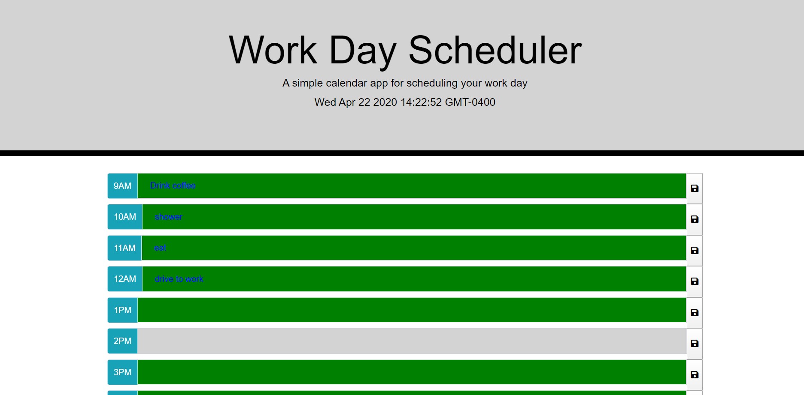

# work-day-scheduler

## User Story

```
AS an employee with a busy schedule
I want to add important events to a daily planner
so  that I can manage my time effectively
```

## Description 
```
User has a calendar app that will allow them to save
events for each hour of the day. Each timeblocks will
changes based on 

```

## Programming Language Used
```
To build the website I used Jquery and moment.js. 
```

## Screenshot of App
---



